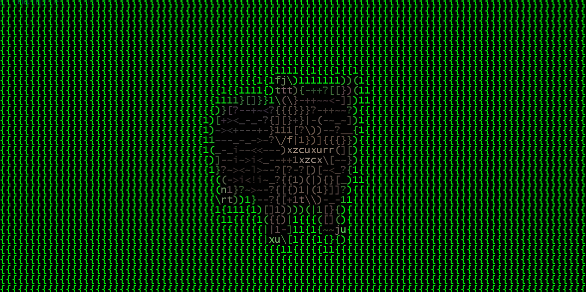

# yt2term

Stream YouTube videos (or direct video links) as ASCII art in the terminal.



## Features

- Real-time video to ASCII conversion
- Optional color output
- Adjustable width
- ~30 FPS rendering loop

## Requirements

- Requires Python ≥ 3.9 due to yt-dlp dependency. Tested only on Python 3.12; other versions have not been tested.

Install dependencies:

```bash
pip install -r requirements.txt
```

## Usage

```bash
python yt2term.py <link> [--width WIDTH] [--no-color]
```

## Example

```bash
python yt2term.py "https://www.youtube.com/watch?v=ODmhPsgqGgQ"

Disable color:

```bash
python yt2term.py <link> --no-color
```

## Notes

- Uses yt-dlp to extract direct stream URL
- Requires internet connection during playback
- Performance depends on terminal speed and CPU

## Exit

Ctrl+C to stop playback
